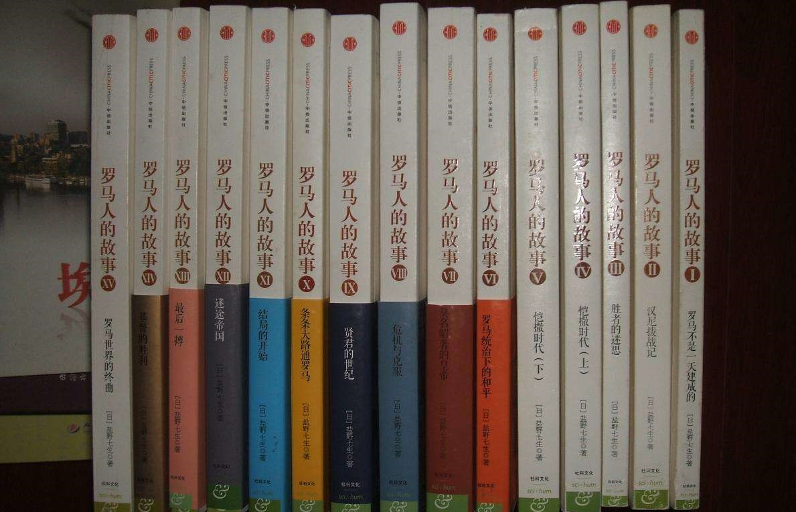

# 阅读管理

#### from 2019/4/8

---------------------
```
楚门界 唯心造 幻化万千 终不离一念

身悬浮云 意在途 负希冀 向光行
```
---------------------

#### :green_book:  已读  :book:  在读  :heart:  想读 

ID | status | [书名](https://book.douban.com/mine?status=wish) | time/author | progress | | thinking |
--- | ---  | --- |:----------:| -----:|:--- |:--- |
1 | :green_book: | 战国日本 | 201904xx | | | :star::star::star::star:|
2 | :green_book: | 5G网络架构 | 杨峰义等/201904xx | | | :star::star::star: |
3 | :green_book: | 通信指导-从微积分到5G| 杨学志/201904xx | | | :star::star::star: |
4 | :green_book: | 极简欧洲史 | | | |:star::star::star::star: | |
5 | :green_book: | 边城 | 二刷 | | | :star::star::star::star::star: | | |
6 | :green_book: | 自控力 | | | |可以归为好鸡汤吧 :star::star::star::star:  |
7 | :green_book: | 观呼吸 | | | | 一句话就是多观呼吸有益 :star: :star: :star: :star: | | | 
8 | :green_book: | 最好的辩护 | 201905xx | | | :star: :star: :star: :star: | |
9 | :green_book: | 耶路撒冷三千年 | 201905xx | | | 翻译差。宗教,语言引导性比较强，人物评述时常为我所用有失客观。<br>历史是任人打扮的小姑娘，好在够长尺度来看，人们的政治立场总是忽左忽右，所以，妆容总会洗去，宗教历史就又不同，任何信仰需要光环加持，一部古兰经管几千年，未来还要管下去，历史需要让这个光环越来越熠熠生辉  :star: :star: :star: | | |
10 | :green_book: | 巨流河 | | | | | | | 
11 | :green_book: |  [松本行弘的程序世界](https://book.douban.com/subject/6756090/) | | | | 不仅是ruby的语法书，内容非常丰富，OO，元编程、函数式编程的介绍都有较详细讲解，安全性和设计模式也有涉及，每一个主题可以独立写一堆书，松本行弘结合ruby及自己理解来讲这些内容，跳着看完全没有问题 :star::star::star::star: |
12 | :green_book: | TED演讲的力量 | 201904xx/安德森 | | | | |
13 | :green_book: | 菊与刀 | 201905xx，二刷 | | |
14 | :green_book: | 斯坦福极简经济学 | | | | 
15 | :green_book: | [地中海的衰落](https://book.douban.com/subject/26667847/) |  20190524 | | | 地中海文明基本上代表了史前人类文明历史，本书对了解地中海及周边文明有帮助，不同文明之间的相互连接、消长有比较深入描述，基本按自然时间基线推进，所有历史事件有非常详细的时间点，便于阅读时横向比对历史关联。 <br> 由于涉及时间跨度非常宏达，而且人类发展进程中地中海无疑是热点，虽然篇幅大，但很多部分由其是后部分，叙事有些潦草。作为了解人类文明和地中海文明的框架很有帮助。 <br> 人类早期文明都是由一些非常小型地域辐射开的，书中有很多地域及人种名称，手头有一本世界历史地图册能帮助梳理脉络。 | |
16 | :heart: | 美国宪政历程 | 影响美国的25个司法大案 | | | | | | |
17 | :heart: | 影响力  | | | | | | |
18 | :heart: | [C专家编程](https://book.douban.com/subject/2377310/) | | 26% | |
19 | :green_book: | 枪炮、病菌与钢铁 | 贾雷德.戴蒙德 | | | | | | |
20 | :heart: | 送你一颗子弹 | 刘瑜 | | | 因为偶尔看到一句话：人的每一种身份都是一种自我绑架，唯有失去是通向自由之途 |
21 | :heart: | 切尔诺贝利的悲鸣 | S.A.阿列克谢耶维奇 | | | 因近电影 | |
22 | :heart: | 不必读书目 | 刀尔登 | | | |
23 | :heart: | 迦太基必须毁灭:古文明的兴衰 | 理查德·迈尔斯  | | | |
24 | :heart: | 希腊人的故事 | | | | |
25 | :green_book: | 大江东去 | 阿耐 | | | |
26 | :heart: | 天朝的崩溃 | | | | |
27 | :green_book: | 中国近代史(1838-1926) | 蒋廷黻  | | | |
28 | :heart: | 《经济学人》熊彼特系列 | | | | |
29 | :green_book: | 两晋：风流总被雨打风吹去 | 刘勃 | 190708 | | 看了20%目前，历史被写的非常有趣，但又不是那种扯淡戏说，有依据有出处，作者有历史功底，引用也比较多，说明是用功做了功课的。书写条理性不错。历史逻辑会通过一些人物的趣事来佐证，看世说新语就知道。两晋是一个很有个性的时代，两晋人物在历史上也是独特的存在，五光十色，张扬个性。比如书中谢灵运的背景和故事，阮籍因被举荐做官而与友绝交故事，士族斗富的故事，“三人行必有食物的故事”，曹丕关于救君主还是救父亲的故事，这些故事多少听说过一些，再看看是觉得鲜活的很，趣味盎然，群体的主流价值观也就不难理解了。（190709）<br><br>书中有两个故事关于石崇和王恺的，石崇是世家子弟，做过荆州刺史，时认为他诗品高，是当时"二十四诗友"之一，录一首诗看看<br><<答枣腆诗>> <br>[魏晋] 石崇 <br>言念将别，<br> 睹物伤情。 <br>赠尔话言， <br>要在遗名。 <br>惟此遗名， <br>可以全生。<br><br>光看这诗是透着些温情和豪情，就是这样一个人富过王公，有一次晋武帝赐给舅父王恺一株珊瑚树，高二尺许，王恺以为是天下至宝，兴致勃勃地跑到金谷园中向石崇夸示，谁料石崇却嗤之以鼻，漫不经意地用铁如意敲击，结果三下两下被打得粉碎。王恺大惊失声，继而勃然大怒道：“击碎吾宝，何嫉妒之甚也?”石崇却心平气和地说：“不必紧张，照原样赔偿你就是了!”于是命仆从把家中藏的珊瑚树全部取出来罗列在桌子上，高三四尺的就有六七株，二尺左右的就更多了。王恺看得目瞪口呆，随便抱了一株，惘然若失地离开了金谷园。<br>这只说明当时这货穷奢极欲，还说明看一个人怎么说外更重要是看他怎么做。 还有个故事说，石崇请王敦喝酒，要美女劝酒，客人不喝，便拉出去杀掉，王敦却偏不喝，连着三个美女被拖出去砍了头。两人面不改色以此为乐，堪为禽兽！<br> 后半部以点带面，写了几个人物司马炎、贾充、陆机、石勒、王导、司马睿、祖逖刘琨、王敦、石虎、慕容翰，大题就当当故事看看了，人物的行事按纪年很多交叉的，显得非常杂乱。
30 | :green_book: | 从1到N:企业数字化生存指南 | | | | 更多的是观念的转型，书中几个观点多少已被反复提及和过度消费了，如用<li>大数据指导生产，<li>IT系统改造以适应企业发展。<br>强调敏捷和开放创新，强调原型以快速响应，强调有重点的安全防护，讨论了OKR制度。。。 |
31 | :green_book: | 黑旗：ISIS的崛起 | | | | 1- 关于极端暴力动机的思考 <br> 2- 关于伊斯兰教及在其中的作用, islam教安拉许以圣战死后的人们一个乌托邦式天堂般生活，许以72处女美酒、花园，各种梦想的生活，虽然，迫于国际影响，某些宗教人士极力淡化伊斯兰教圣战殉教上天堂的极端思想，但这种立足传统典籍的思想，其根深蒂固非三言两语可消解的，其现实作用是不可否认的。由其是极端原教旨主义其战争手段的需要对此的解读更甚，长期潜移默化的意识形态教育，人们对此无比向往，islam国家多半遭受战争摧残，理想与现实的差距，加深了信众对死的向往，先知默罕默德的战友、7世纪圣战士哈立德-伊本-瓦利德的话说：我的手下人求死的意志和你们求生的欲望一样的强烈，这样一群亡命之徒你如何与他斗，所以冷兵器时代他们战麾所向是无往不胜的。islam教的传播一直伴随着强势的征战，武力手段一直是islam世界的首选解决方案，暴力从默罕默德创教以来一直根植与伊斯兰的基因中。在冷兵器时代，一切的生存法则要求islam用强制仪式保持其“纯净性”而不被同化，用理想天国保持足够吸引力，用暴力保持其竞争力。从而保证了伊斯兰的传播性、或侵蚀性，也为伊斯兰世界的的迅速扩张打下牢固的基础。趋势来看伊斯兰人数超过基督教是早晚的事情。<br> 3- 关于国家权力的平衡 <br> 4- 关于人性的思考, 披着正义的、教义的旗帜行极端罪恶之事。在极短时间汇聚极大能量的isis反证了原教旨如黑魔法有魔性的感召力，如果说isis初期是有伊斯兰理想的，那么后期的一系列残暴行为,甚至火烧逊尼派教士，就纯粹是如同一个不成熟的原始部落人祭般的震慑、作秀和宣誓，已然与伊斯兰教义渐行渐远了。书中扎卡维出身无非是一个贫穷街区的小混混，整天不是无所事事就是打架斗殴，并没有坚定的理想主义色彩，这种乌合之众很容易被洗脑并注入被修改的、有目的性的、有煽动性的所谓教义，这就好比现在传销组织主攻对象就是涉世未深的年轻人或者思想简单僵化的老年人，况且在狱中给他洗脑的不是一般人，是大名鼎鼎拥有博士学位的伊斯兰教学者——巴格达迪，于是扎卡维醍醐灌顶，找到了自己的使命感，讲演时读古兰经还会泪流满面，由内到外简直换了个人，加上多年接头斗殴经验，在狱中坐定了老大位置，甚至狱中特殊状况，扎卡维可以通过眼神操控他人，从他和他人表现看扎卡维无疑具备一定的领袖才能，其人言行也认定自己是天定之人。 从他的性格和行事风格看，年少时的品性并未因为皈依伊斯兰教而有所收敛，无非是扛着大旗行混混之事，扎卡维的性格是分裂的，书中说他即便是他已成为ISIS的真正领袖，他仍然可以会完情人后，若无其事进入清真寺祷告。当这个组织的国土大抵够的上伊拉克三分之二面积时，种种疯狂昏招肆意妄为也加速走向灭亡。 （190708） 扎卡维一直是一个恶人，因此，他一直渴望献出生命成为一个“舍希德”（殉道者），唯有如此安拉才可能原谅他，洗涤他过去的种种罪恶。 
32 | :green_book: | 驯服利维坦 | | 190723 | |  * 读一篇关于英国保守主义学者伯克的文章里提到王建勋的这本书，查阅kindle并无此书，taobao发现都是巨贵的，要么是便宜的翻印版本，好在读书无洁癖，￥13捡了一本。的确是我收到过的盗版书里印刷最差的没有之一了。 <br> * 此书的确是非常的关于宪政的入门读物，对于政体设计的理念，由其是以美国的宪政为标本，引用经典文献，观点都有辅助于文献（文献小字实在字迹模糊），观点也非常鲜明，对于横向和纵向分权，自由，自治能理念比起一些译本讲解流畅易读的多 <br> * 三 |
33 | :heart: | 国王的两个身体 | | | | |
34 | :green_book: | 神门自己 | 阿西莫夫 | 190801 | | 科幻，70年代写的，关于平行宇宙，太超前了，作者神啊。译本也相当流畅。 地球和平行宇宙的那一边的故事各自独立，又以能源的传递相互连接在一起。 平行宇宙那边的高度文明，想象力极为丰富，不像一般科幻片外星人多少带点人类的印记，这里平行宇宙那边的人，完全是另一种形态的存在，关于你那些人的交配繁殖的情景细微入至啊，有趣有趣。 书中的第三个世界就是迁移到月球的人类的生活，此时居住在月球上的人类就如同地球人的一个遥远的属国，地球是宗主国，月球人的生活，以及月球人与地球人之间的相互看不上甚为生动。月球人对地球人的愚蠢大多嗤之以鼻，地球人觉得月球人怎么可以忍受一切人造没有绿植和阳光的环境，月球人觉得地球人那是你不是鱼焉知鱼之不快，总之隔阂严重。对月球的生活环境和娱乐方式的描述也是相当有意思。 之所以为经典，在大量科幻料外，写的还是人性。 |
35 | :green_book: | 发条女孩 | | 190727 | | 朋克科幻 | | | |
36 | :green_book: | 时间之墟 | | 190729 | | 科幻，才30万字，感觉特别长篇？脑洞大开，花了一天，看了一半，构造了一个24小时重复的世界，24小时后的世界会被reset下，这下可以为所欲为了，如果愿意，可以实验各种活法，于是乎道德沦丧，秩序崩溃，人性之恶张扬，几个轮回便回到蛮荒时代，混沌状态必须要有宗教加持，相当扯淡，据说刘慈欣很推崇，不过刘慈欣越来越商业了。这个视角还是不错，可以写出宏观题材，能探索人性、情感、价值观，就像邓肯《源代码》多次穿越平行宇宙去探索8分钟的犯罪现场。轮回、遇见从前自己、观察父母的生活历程，这些都无限遐想题材，是一种视角，场景的真实性已经不是最重要，重要的是这样的场景下人会怎么想怎么干，就像先哲和物理学大咖们构造我们的世界，靠的就是脑补的思想实验 | | | |
37 | :book: | [杨小凯谈经济](https://book.douban.com/subject/1074525/) | | 190804 | | 写牛鬼蛇神录的杨小凯还叫杨曦光，很有文学作家潜质，可见聪明人的确可跨界 |
38 | :green_book: | 瞩望新轴心时代：在新世纪的哲学思考 | | 190715 | | 老爷子国学底子深厚，学不来。<br><br>世界范围看宗教往往一路伴随着血腥战争，中国似乎是个例外，儒释道在中国碰撞的过程中，碰撞冲突产生规模战争的例子是极少，如南北朝时期的灭佛，放在历史来看也是短期的，主流是温和的相生相长，一路融合，互相吸收，齐头并进的[参](http://www.360doc.com/content/17/0511/07/9331441_652877624.shtml) :star::star::star:| |
39 | :green_book: | 魁拔之书 | 青春树 | 190805 | | 看了魁拔1、2、3电影 ，找了这本书，相当于电影的前传，像魁拔编年史，书的故事性差些，世界观宏大，的确如果要故事性和细腻，一本书根本不够写，电影比书好看，魁拔4据说20年来，要看。<br> 玄幻性可以，科幻不够硬，总之好过哪吒 哈 :star::star::star::star::star:| |
40 | :green_book: | 重新定义团队：谷歌如何工作 | | 190806 | | | 本想了解OKR的，查到这本高分书，谷歌HR写的，内容主要关于人力资源管理的思考，从谷歌公司人力资源管理多年的实践总结的经验，当然很多内容关乎企业文化和企业财务状况，HR工作者看了定有很大收货 |
41|:book:| 群氓之族 | 201908 | | | <li>理论基本比较大路，并没有有耳目一新之感，不过摆事实讲道理，摆的例子都是很有意思的，尤其对亚洲民族的人性有比较深刻理解，加之作者身为一个西方人，相对来讲讲述的视角与我们会有写不同，兼听者明吧，后半部分读起来味道好些。翻译兼具文采和流畅度，现在的很多流行书翻译看不下去的一个重要原因是翻译，邓伯宸，找些他译作的其他说看看<br><li>不管怎样自由开放，人类群体认同的底层逻辑还是无处不在的运作着<br><li>人类既怕不同而被落单，又时常处处彰显与众不同以突出群体的优越性 <br><li>一个国家的历史既是一种开来的力量，也可能是一种阻力，国家或民族都在寻找历史的遗迹来加持前进中精神的力量，这种力量往往比我们认知的强大的多的多。比如犹太人，几经灭绝之路，这点香火也就靠两千年前的精神传统传续着，这种精神/宗教传统让人笃信他们是上帝的天选之人，让民族能够形散而神聚，这也是为什么自公元73年后犹太人到一千年后复国后能够把世界各地来的犹太人团拢在一起。<li>菲律宾人则是一个反面的例子，菲律宾历史总是被征战和征战后的屈服，美国人来了就依附美国人，西班牙人来了就归顺西班牙，又被日本人蹂躏，菲律宾人视美国人和西班牙人为高贵，与他们混血的也要高其他人种一等，以然是一种文化，实在是奴性很重，菲律宾人也逐渐反思这种文化，当一些菲律宾志士想要去追索他们的历史时，他们发现其实他们一向看不上的土著的马来人才是他们比较纯粹的血统未被美国人、西班牙人、华人、日本人污染的同源同胞，而从历史的蛛丝马迹中又鲜能找到可歌可泣的抗争事迹。苦难中抗争是能够是一笔巨大财富的，尤其是对一个民族。<li>比较有意思的是书中关于土耳其的例子，20世纪初，土耳其民族主义抬头，为复兴古老的土耳其，努力去寻找一个早于伊斯兰，早于奥斯曼，早于波斯人的古土耳其，35年，土耳其名族主义领袖xx，制造了一出戏码：在中亚某处，一个土耳其人站在文明的曙光中，面对太阳，吐出了人类第一个土耳其语的“光”，于是所有的文明、语言从此诞生，从这个源头衍生开来俄罗斯、欧洲、中国、阿拉伯文明:relaxed:，这的确是一剂猛药。<li>到中国文明是货真价实的，汉文化的源头从未中断，犹太人也是，以色列人可以讲者希伯来语，精神源头从未间断，不同的是犹太人是形散的，中国是形聚的，汉文化熔炉总是把其他入侵文化打散揉碎消化吸收消遁于无形中，以色列人深刻认同自己犹太人的身份，而又来自世界，犹太教底色上的多元，也是以色列复国后迅速崛起的原因，中国向内的文化传统，向来以中心和文化的俯视者自居的，容易有意识的忽视优质多元文化，开放性不够，文明的厚度是财富也是包袱，自信而不是自大，自审而不是盲从。<br>宗教是对一种对超自然的信仰，是人对不确定性的恐惧寻找的心灵的庇护，按此说，宗教绝对是私人的，而宗教又是一种手段借此区分族群，群体有增加了个体间的心理连接，这种连接更可排遣个体的孤独无力感，连接也形成了力量，因此，宗教不但是安慰的活水，也是形成权力的手段。宗教间的摩擦冲突重来没见间断，而究冲突的本源，宗教并不必定是最重要的原因，宗教只是方便区分敌我的工具。<br>
42 | :heart: | [奥斯曼帝国](https://book.douban.com/subject/33387414/) | time/author | progress | | review | |
43 | :heart: | [遙遠的目擊者](https://book.douban.com/subject/25736938/) | time/author | progress | | review | |
44 | :heart: | [持续交付](https://book.douban.com/subject/30419555/) | time/author | progress | | review | |
45 | :green_book: | [帝国的终结](https://book.douban.com/subject/2299164/) | 易中天 | progress | | 以古喻今，对中国政治制度之现状会有更多理解，中国为什么会走到现在这样，辛亥革命为什么没有成功，64为什么无法成功，对于这些现象会有更多理解。对制度的理解，似乎都能道出个1234，其实都是道听途说，雾里看花，深层次原因，固化与不同民族中的基因密码是什么，是值得思考的，这是所谓的历史的一些必然，以史为鉴讲的应该是这层含义。这本书是作者对这一课题的思考。<br> <br>书中以中国从殷商文明到辛亥革命革命历史，渐次给我们梳理了中国政治制度的演变，特点，并加以对比，并偶尔与国外的邦联、共和制度做横向比较。关于邦国与郡县，封建与帝国，邦国与城邦，邦联与联邦等概念讲的比较透。并结合不同政治制度的制度架构，文化特征，人的组织，阶层及阶层的角色，道出制度特点和发展的必然性。作者认为从秦朝开端，中国开始了帝国时代，直到辛亥革命，秦以法治国，法发家强国可以，没有教化作用，治国不行，而焚书坑儒等暴政跟加速了帝国的死亡。自汉开始帝国开始理治，辅之德治，出现帝国繁荣。而后世集权日甚，明朝甚至取消了宰相治，表里都是君主一人说了算，帝国下，分权与稳定总是矛盾，帝国不容许有丝毫威慑君权的因素存在，过分集权又势必造成从上到下，全面钳制人的生存空间，帝国的活力每况愈下，到一定程度就进入下一个循环。所以，似乎集权再集权似乎是帝国发展的必然，那么帝国发展到倒台这个死循环魔咒一直不能破，而在此循环之外的少数特例，如魏晋、民国这类失衡时序下，又是国败民亡，这真是个死结。<br><br>在选人上，从察举制到荐举制到科举制有其进步性，魏晋时期举荐，形成了官职的垄断，大门阀尾大不掉，看看世说新语这些门阀出售宽绰，实在超过国君啊；科举制帝国只是给你给官位，换来儒生死心塌地服务于帝国，相当合算的买卖。 <br> <br>这书经常可以看到作者思考的火花，读起来也比较容易，失之于内容比较散，而且较多重复，比如关于郡县和封建的阐述，不够有机。总体不错:star::star::star::star:| |
46 | :green_heart: | [揭秘日本民族性格和心理的形成：日本战国史](mzx.md) | 不详 | progress | | 估计是长篇网文，作者对日本战国史了解还是相当深入，日本战国阶段大体真实，毕竟不算太久远，相当中国明朝，不过关于大名间的对战还是说法不同也缺少史料，不同作者为故事的丰满也不乏添油加醋，这篇把战国前因后果结合日本民族性来讲，骨架都有了，并且脉络清晰，不像日本女作家茂吕美耶[<<战国日本>>](https://book.douban.com/subject/5283574/)那么细腻、有较强的故事性和作者主观解读 :star::star::star::star: |
47 | :green_heart: | [中国画的写意精神](https://read.douban.com/ebook/35250246/) | 20190901/唐建 | | | 从中国画历史渊源、中西绘画对比纵横两个维度看中国画的美学特征及内含精神，大量引用书画家书画论观点，中国艺术是诗、书、画、印四位一体的，书中也兼探讨了一些书法篆刻的审美取向，并通过唐寅、八大山人、石涛、徐渭、郑板桥、吴昌硕等人的艺术实践和画论谈文人精神与画作关系。<br><br>中国画写意精神所追求的气、神、韵、味，与中国的儒释道的精神是契合交融的， 诗画重蕴含品质、格调、韵味与人的修养、思想所构成的意境美即是儒家价值观在书画审美上的体现； 老子强调的“少则得、多则惑”“大道至简”也是中国画所强调的写神而非模形的来源，“笔有尽而意无穷”，“传神论”是中国画一脉相承且延续至今的写意的核心理念； 中唐以下，禅宗以其去繁就简，简静清妙，清真洒落，而别开生面，为当时文人士大夫思想风尚，绘画受其影响也别开纯清幽淡水墨之法门，王维便是此“文人画”之祖师爷，其“诗中有画、画中有诗”及将禅意融入山水画作，以禅入画便是这一思想的极佳实践。得意而忘形，如郑板桥画竹，了然于胸后又化为胸无成竹，是最高境界了。<br><br>中国之诗书画印一体，甚至强调善书必能画、善画必能书能书，认为书画线条实为一体，关于这点清代吴昌硕就有以篆籀笔法入画，别开古朴遒劲之生面。郑板桥以画竹笔法写8面出锋之6分 <br><br> 中国士大夫除了浸淫儒家尚纲常，风骨节操历来是备受诊视的，中国画甚至中国艺术，特别反对繁、臃、俗、艳，强调的简、雅、拙、淡与这种仙风清意都是没有违和感的， 这在傅青主这里甚至走向了另一个极端，主张“宁拙毋巧,宁丑毋媚,宁支离毋轻滑,宁真率毋安排”， 从这个意义上来讲，丑书未必真丑，看你怎么看，看你懂不懂，看能不能共鸣 <br><br> 傅青主的说法在当前似乎已被过度解读或误读，他并不是鼓励胡来，相反这种说法我理解是鼓励创新，突破陈规陋习，大众审美，创新也不是胡乱创新，而是在了然于胸后的蜕变，这便是师古人的重要了，“学不师古，如夜行无火”水无源定不活，古人实践便如活水源头取之不尽用之不竭，师古而又不可泥古，有没有勇气从浩瀚古法中打出自己的路子，如何拿捏似与不似之间，达到“山是山非山”的禅境，便是造化了。 <br><br> 书中也谈及中西绘画之差异，这是一个很大课题啊，记得有人说过，素描是一切艺术的基础，绘画、雕塑、建筑、设计都与之密切关联，而素描是写实的，线条要准确反映实物，西方绘画也有简化，但这种简化不是写意的，这种简化是以准确为基础的简化，如印象派细看似乎胡乱着色，甚至有些大写意的意味，其实理念完全不同，西方画他是符合透视原理的，定位准确的，这是基础，中国画是强调写意，其抽象是要简还不能太像，似与不似之间，意境是画心中的那个画，心中这个画便包含追求、理想、态度， 如八大山人那只白眼看青天的鸟，这只满腹扰骚鸟，三两笔足矣。<br><br>书中很大篇幅论证汉文化对于写意精神的启蒙作用比较牵强，汉文化当然对中国艺术的启蒙作用巨大，汉绘画书法浩若繁星，秦汉之前古人对于书法绘画是摸索的，如此，艺术形式就比较发散，稚嫩或者古拙质朴的，秦统一和国力的繁荣，文化上也趋于儒家一统，方向也从无数多头，趋向几个多头，形式更严谨，我们观看汉画汉书汉印都有这个特点，规矩严谨不失法度，艺术上人类逐渐步入成熟期，这种成熟还没有发展自觉的写意的，由其画作或雕塑上的线条感，还没有参数与西方完全分野的写意来，这要到魏晋南北朝佛道繁荣才逐步上升形成  :star::star::star: | |
48 | :green_heart: | [简素](https://book.douban.com/subject/26856952/) | 20190903/冈田武彦 | | | 作者冈田武彦把日本人的精神世界概括成“简素”&“崇物”，看完简素部分，基本关于日本美学物哀、幽玄、侘寂、意气四大特点都有涉及，简素前几章节泛泛而谈而无实证，强调日本简素精神与中国之不同也较牵强，日本至少在明治维新前的文化，尤其是书画艺术是一脉相承与中国，基于本土化的少量改动或谓之创新必然会有。<br><br>书中在绘画艺术开始倒是可看，讲日本简素精神来源分析是基本上大量的讲的是中国唐宋以来的书画家的作品与观点，高度概括和精炼，关于中国画唐宋以来南北派，北派写实的院体画为宋人所重视，南派写意的文人画到宋末元明逐步成为主流审美，作者的理解也相当到位，关于日本艺术书中还涉及陶艺、建筑、文学（主要是日本的随笔、俳句、练歌），结论是表象上日本艺术大量的来自中国，明治维新后来自西方，但日本人在改造吸收扬弃的基础上形成了自己简素的审美取向，与中西文化都是极不同的。<br><br>讲日本文化的确是绕不开中国的，讲中国文化的精彩其实又很难突出日本文化的优势，拿绘画艺术来说，日本人崇尚的所谓简素，本质上就是完全来自中国绘画的简素精神，是向内的，是写心的，这是源头，而且中国到明代写意画百花齐放又浪里淘沙已经发展到了极致了，日本绘画要么秉持中国绘画传统，而所谓创新又容易走向虚无，完全的脱实就虚，如书中就有一副日本著名画家[仙厓](http://www.360doc.com/content/15/0529/10/25473077_474153268.shtml)的禅画[<<○△□>>](https://www.douban.com/photos/photo/2190323682/)，仙厓称日本第一禅画家，甚至到极端发展到所谓的“白纸赞”一张画空无一物，的确够简素的，日本人情绪化和走极端民族性可见一斑（在日本人那所谓的道），书中以此论证日本绘画较之中国绘画更为简素，大谬，实为对中国绘画之追求还欠深刻啊。中国并不被视为最好的画家在日本却被广泛接受，而且视为超一流的，如书中举到的南宋南派画家牧溪，在中国评价是“粗恶无古法”，牧溪虽为南派，手法还是以写意笔法写实，不如文人画写心中之意，胸无成竹的审美意象不合，不够骨气，还是妥协，不能免俗。而这恰恰是非常符合日本人的审美的，后来日本画家长谷川等伯学牧溪法成为日本画界大师。这正好反证了日本绘画的妥协，学了写意之法，而又走实用的道路，此处日本人妥协和实用主义的性格又跃然了。<br><br> 另一个走极端的例子便是日本绘画发展到浮世绘和装饰画在实用主义道路上又前进了一步，写意精神是没有了，浮世绘是当时小市民主流审美，反映的内容也是世俗生活、感官刺激，所以早期实际上并不是我们看到富士山、浪花的经典浮世绘作品，而充斥大量的色情内容，这当然与文人画追求的写意风马牛了，甚至完全背离了传统简素精神，所谓的简素精神当然也只能与西方油画比较了，据说莫奈、梵高、马奈都是受了浮世绘启蒙，才有后来《向日葵》《星空》印象派作品，这不可考，实在是大俗大雅。 <br><br> 日本俳句 <br><br> 考察浮世绘版画线条及平面造型，来源于汉画的说法似乎有几分道理?(待以后考证了) | |
49 | :heart: | [越讀者](https://book.douban.com/subject/2062414/) | time/明義/張妙如  | progress | | review | |
50 | :heart: | [牡丹亭](https://book.douban.com/subject/1073708/) | time/明義/張妙如  | progress | | review | |
51 | :green_book: | [枕草子](https://www.amazon.cn/mn/detailApp/?tag=doubandongxi-23&asin=B005ARG16K) | 20190905/[日]清少纳言 (作者), 林文月 (译者)  | 50% | | 都首推林语堂译本，一来林是日本女婿久居日本，二来林本就文学大家，试阅部分略过白话，可能与当时白话运动有关吧，内容本就直叙生活见闻琐事，白话就略显平铺，林文月版本则较婉丽优美一些，大概是女性译者更能揣度女性文字。 记录的是宫廷及生活见闻，像短小随笔日记，写人物、动物、景致、器物，天然短小，不事雕琢，与《方丈记》《徒然草》并为“日本三大随笔”，与《源氏物语》合为“平安文学双璧”。周作人评价 "机警之中仍留存着女性的优婉纤细的情趣，所以独具一种特色。", 称日本随笔文学的源头。<br><br> 写宫廷却不迂腐，笔触细腻。成书千年前，现在读来写情写景写心也感亲切，时常有趣，如有一节叫没志向老老实实，说“我最看不起那些没什么志向指望，只一味老老实实呆在家伺候丈夫，便自以为幸福的女人。” 哈哈，与我之了解日本家庭观念及不同啊 | |
52 | :heart: | [她身之欲](https://book.douban.com/subject/26804793/) | time/author | progress | | review | |
53 | :green_book: | [反思法国大革命](https://book.douban.com/subject/25904019/) | time/author | progress | | 与我们从历史书中习得的关于法国大革命的片言只语相去极大， 伯克用尽了所有反面词汇来评价法国大革命， 法国师承英国，闹成这样实在让英国这个祖师爷看不下去， 最关键的是法国革命是国民议会策动， 这些人既不是教士阶层、贵族阶层或王公贵族， 卖鱼修鞋弹棉花的都有， 在英国贵族们看来素养不高， 而且很容易被洗脑鼓动，的确是一群乌合之众， 他们动不动就是革贵族的命， 路易十六也是直接被拉上断头台， 这完全不同于英国的光荣革命， 英国1688光荣革命没死一个人废掉詹姆斯二世，他的儿子威廉三世当上国王， 此后的国王已经变成虚位元首了，议会的权力逐渐超过国王的权力， 威廉三世颁布了《权利法案》， 逐步从国王为核心君主专制转变成了议会为核心君主立宪这样的政体， 英国国王更多是象征意义， 英国人也是非常尊崇这一传统， 对国王非常爱戴， 这有点西周时候周王的意味， 尊王攘夷哈， 所以整体上英国王室日子还是挺好过的， 俸禄不少， 烦心不多， 可以说说闲话散散心， 自由度也比较高， 只要不作死， 还是广受爱戴， 相比现在闹脱欧下被怼来怼去的首相， 国王还是舒爽。 <br><br>转回法国大革命， 法国的这种操作让英吉利海峡海岸对面的英国贵族王室们颤抖了， 伯克就是在这种环境下写的这个信， 这个文风简直是战斗檄文，火力十足， 又有理有据温文尔雅， 文笔流畅优美， 功力真不一般啊， 很多观点是真知灼见， 伯克一直是民主政治的坚定支持者，曾支持美国独立战争， 这本书让时人误以为伯克背叛了自己，成为了民主的敌人， 现在看来并不是， 大革命留下的一地鸡毛的确只能通过更强有力的独裁铁腕来收拾， 拿破仑法兰西第一帝国的建立印证了他的预言。 <br><br> 大革命后革命和复辟成为常事了， 好在法国人革命浪漫主义精神薪火相传， 最终战胜复辟王朝， 成功建立了民主共和国。 <br><br> 现在香港乱局， 港人好好读读此书， 必定获益良多  :star::star::star::star::star:     | |
54 | :green_heart: | [永恒的终结](https://book.douban.com/subject/25829693/) | 2019/9/14/中秋/阿西莫夫 | | | 阿西莫夫的小说总能在一开始就抓牢眼球，有阅读畅快感。<br><br> 这次是关于时间旅行，中秋旅行之最佳伴侣， 构建了相当恢弘的时间尺度，此时所谓永恒之人能乘坐时空壶，穿梭于20世纪到20万世纪，并能干预历史，对某些历史节点做出小小的修正， 而避免大灾难的发生， 人类的发展一切尽在掌握中。 修改某一事件带来后续发展轨迹的不同， 前后是因果， 形成闭环因果链， 所以人类自身并不觉知， 永恒之人是如神般的存在。 主角在某次被派到483世纪执行任务过程中， 与女主邂逅， 成为故事发展的最大内因， 男主发现还有一个隐藏世纪， 这个世纪的人们也拥有时空旅行的能力，不同的是他们只观察历史，而不会去篡改历史， 通过观察他们发现了历史被篡改的事实及永恒之人的存在， 他们认为这种上帝之手带来的秩序不是帮助人类发展， 而是人为的规避了自然选择的多样性， 从而抑制了人类的进化， 永恒之人甚至制造了一些障碍让人类无法真正掌握星际旅行的技术， 一方面使得人类永远无法窥探永恒之人的干预， 另一方面导致银河系中类地球星球上居住的是各种的外星人而非地球人， 人类在宇宙中的竞争失去了先发优势。 女主便是隐藏世纪派来的，目的是渗透到永恒之人中， 改变时空技师的价值观。 最后女主伊诺说服了男主哈伦， 哈伦没有把永恒时空的发明人马兰松送回正确的年代， 意味着永恒时空没有被发明， 破坏了永恒时空存在的因果链， 永恒之人篡改历史的未来也不复存在。<br><br> 关于永恒时空我们无法证明，也无法证伪， 书中说1945年核弹爆炸就是永恒之人制造的， 以警示人们， 从而避免了核战争人类灭绝的结果， 哈哈 <br><br> 愉快的结局， 时间跨度非常宏大， 但是主线还是比较清晰的， 伊诺和哈伦的爱情，哈伦在永恒时空的工作， 推动情节发展。 <br><br> 除了爱欲这个最永恒主题外， 探讨所谓为低等物种考虑的人为的干预是否为其带来了反作用， 在我们看到所谓好的结果的时候，意味着可能性被剪除了，而这种可能性或许就是进化的契机。 :star::star::star::star::star:     | |
55 | :green_heart: | [禅的故事](https://book.douban.com/subject/30264998/) | 20190917/易中天 | 100%| | 禅源自印度语"jana"静的意思，音译"禅那",后世称"禅"， 禅宗发源自印度， 释迦摩尼讲法时通过“拈花微笑”传给摩柯迦叶， 摩柯迦叶及之后在印度传了28祖， 菩提达摩是禅宗在西天二十八祖， 中国南北朝时达摩到中国传法，是汉禅宗始祖。 <br><br>时梁武帝慕名问道与达摩 <br><br>梁武帝: “大师，我修众寺庙，抄众佛经，广供养，我功德如何？”<br>达摩: “无有功德”<br>梁武帝: “明明功德巍巍，大师为何说没有功德呢？怎样才是功德？”<br> 达摩: “不可着功德之相，自净其意，自空其体，不着贪相，不以世求。”<br><br>鸡与鸭讲，谈话并不愉快<br><br> 后达摩到少林寺后山洞中面壁9年，后传衣钵与慧可，授<楞伽经>四卷，并立下“直指人心，见性成佛，不立文字，教外别传”， 这些故事当然大抵90%以上是扯淡的， 印度那二十八祖印度历史和经书上不可考，所以叫教外别传，就是体系外的，所以无记录，倒也能自圆其说，不过禅宗在中国快速传播，尤其为很多士大夫所接受是事实， 我们知道就有苏东坡与禅僧佛印的故事。<br><br>那么禅的核心精神是什么呢， 总结来看几点， <br>一是悟，禅不是知识，通过讲授就具备了，所以在禅宗这里，有没有文化不重要， 六祖慧能就是文盲， 有没有地位不重要， 几代祖师都是地道草根， 有没有悟性是关键， 禅宗师父干什么的， 可以帮你悟， 比如用讲故事,禅宗里叫公案， 给些提示啊， 禅宗叫机锋， 甚至用粗暴的呵斥和殴打都有， 手段不一而足， 主要还是靠自己悟。 悟可以是快或慢，既顿悟或渐悟， 顿悟是六祖慧能南宗观点，渐悟是神秀北宗的观点， 神秀后北宗无继， 南宗光大。 <br>二是执，或破执， 执则迷，迷则不悟，破执就是去除一根筋， 破了执就是自由了， 每个人都有各种执念， 破执是很难的事情， 要破我执，法治，空执， 我执就是自我执念， 法执就是对规则的执念， 空执就是对空的执念， 这个不好理解， 万法皆空， 鸡汤常说的放空， 怎么还有执， 执着于空，开口闭口说空， 你认为空无， 就是实相？也是执， 空也是空。大乘佛教观点就是: 非有 非无 非亦有亦无 非非有非无， 其实翻译成计算机语言就是 0 1 00 11 都不是。 书里说破我执就是罗汉，破法执就是菩萨，破空执就是佛了， 可见禅宗修为标准是很不同的  <br>三是空，万法皆空，诸相空相， 这里的空也是空， 不是说这杯水空了， 这是实相， 落入实相又非空， 所以， 禅宗不可说，一说就错， 就是一说就落入实相。 靠体悟吧。 <br><br> 这本小书可读性好， 关于空和执的理解精道， 关于禅宗的核心要义不够系统， 这本书是易中天讲演稿， 是关照的趣味性和可讲性， 了解个大概还是不错啊， 关于破执里边的一些故事有趣 <br>[补充:禅宗法脉记要](https://app.yinxiang.com/fx/1bedd12c-c46b-4ba3-b7f8-c7bc0f4883e6) <br> 禅宗的机锋总像做脑筋急转弯， 待我读完六祖坛经再来评价 <br><br> :star::star::star::star:    | |
56 | :book: | [人间草木](https://book.douban.com/subject/1253310/) | 20190919/汪曾祺 | progress | | review | |
57 | :book: | [五灯会元](https://book.douban.com/subject/1821146/) | time/author | progress | | review | |
58 | :green_book: | [消失的殖民星球](https://book.douban.com/subject/26787943/) | 20190924/[美]约翰·斯卡尔齐  | 100% | | 背景宇宙在殖民星球管辖下，不断开疆拓土，发现新星球并不断殖民。帝国找上退伍过着平静生活的夫妻约翰和简，派往新殖民星球洛诺克星。实际上征程没有那么简单。。。 <br><br> 正常情况下，这个小小的殖民星球应该挂了N次， 各种机缘加约翰和简的个人能力使的它成为抗衡两个帝国（殖民联盟&种族联合体）的绝好棋子，看似命悬一线，而又转危为安， 故事跌宕，主人公光环照耀。<br><br>人物和对话生动， 偶然性有点多， 拍成电影一定被吐槽， 如最后种族联盟与高将军作对的反对派来袭，本来力量对比是蚂蚁与大象，但因为偶然得到苏康人的大杀器，打败种族联盟的412只战舰。 给高将军的情报也比较突然，似乎剧情需要  <br><br> 前面多次渲染的简的超能力没怎么用上，受奥宾人保护的女儿也应该有些与众不同吧。 洛诺克上的智慧生物侵扰一次后面就没有出现不合理啊 <br><br>写宇宙其实还是写我们现在的这个事件，把星球换成国家，外星人换成外国人， 那些合纵连横和信息战的故事依然套用。科幻的表象，阴谋的内核，是政治熟悉的讨论，还有那美式电影里拯救世界的个人英雄主义熠熠光辉。 接着看《幽灵舰队》《佐伊的战争》《人类决裂》 :star:star:star:star: | |
59 | :green_book: | [幽灵舰队](https://book.douban.com/subject/32577560/) | 20191002/[美]约翰·斯卡尔齐 | 100% | | 国庆日本期间陆续读完，白天走的腰腿痛，晚上躺酒店看书是享受。 故事从三个外星种族结盟（勒雷伊\艾尼沙\奥宾）准备夹击人类展开， 1对3的战争一旦爆发， 人类胜算的概率几乎是0， 于是人类防卫军的特种部队展开反围剿， 除了各个击破，先瓦解掉勒雷伊、艾尼沙， 最为关键的是人类最厉害的脑科学家布廷叛逃， 布廷是防卫军大脑"脑伴"的发明者。 <br><br>岔开来说下防卫军及脑伴，防卫军战士是克隆身体， 克隆出来的使命就是保护人类， 通过植入脑伴使得刚克隆出来的身体拥有“大脑”， 脑伴保存海量知识， 如同一个微型量子计算机， 脑伴可以与原生大脑通过神经无间隙链接， 可以帮助指挥大脑， 而且防卫军脑伴之间还可以相互链接， 实时共享敌情和信息， 于是防卫军能力超强， 行动敏捷， 突破原生人类各种能力的极限， 然而， 防卫军无时无刻不生活在脑伴链接的世界， 同伴间的交流、情绪都是通过脑伴传递， 而一旦脑伴见断开链接，作为人类保护者的防卫军战士会产生极大的心理和生理负面反应，而失去作战能力。 <br><br> 回到布廷， 布廷叛逃到奥宾人那里， 在奥宾人帮助下继续研究脑伴， 制作了断开脑伴链接的设备， 而奥宾人则想让布廷帮助他们修补他们大脑中与生俱来的无情绪的缺点（苏康人在制造奥宾人的时候埋下的雷，如同英国人离开交出殖民地领导权时必要埋几个雷便于他们以后继续操控一样道理）， 无情绪的奥宾人看起来都是相当佛系的， 但奥宾人认为情绪这个东西是好东西， 对此有种宗教般的向往， 这在《消失的殖民地》里有延续。 <br><br>搞定勒雷伊、艾尼沙后， 对殖民联盟来说最大的雷就是布廷了， 于是克隆了一个防卫队士兵雅列，并把当时布廷叛逃是没有来的及销毁的他本人的大脑备份注入他的脑伴中， 计划是通过唤醒布廷的意识回忆布廷叛逃的原因和藏匿的地点， 谁也没有把握能否唤醒布廷的意识， 谁也没有把握唤醒了布廷意识后的雅列还是不是雅列， 也没有把握唤醒后的雅克变成布廷会不会干布廷一样的事情去摧毁人类， 当然后来雅列发现布廷的记忆被激活，并发现了布廷藏身奥宾人的地方，于是与他的二排战友一起去完成刺杀布廷的任务。<br><br>雅列后来见到布廷后， 布廷的计划是抹去雅列的记忆后， 让雅列杀了原生人布廷， 留下的只有布廷的记忆， 那么雅列就只有布廷的灵魂了， 雅列就是真正的布廷了， 而雅列在两个自我中最终选择了用智能血杀了布廷和自己， 从而世上无布廷了， 人类殖民联盟避免被毁。 <br><br> 剧情宏大复杂， 对话和人物还是相当有生动， 故事精彩， 科幻硬核， 比《消失的星球》好看。 <br><br>这是一个秩序内的人对秩序不满的反乌托邦的故事，人物并非那么的非黑即白， 反面人物布廷在防卫联盟中有崇高地位，他的叛逃除了更宏大的利益驱动外， 也是对殖民联盟现状的不满，在殖民联盟管理下， 各殖民地的人类似乎变成圈养的动物，尤其是地球上的人类， 殖民联盟严格控制着舆论和发展轨迹，摘录几段他和雅列的对话。<br> “我什么都不指望你，”布廷说，“因为你屁也不知道。防卫军的普通士兵根本不知道这件事。殖民者显然也都不知道。殖民联盟拥有所有的飞船、跃迁无人机和通讯卫星，在空间站处理所有贸易和少得可怜的外交事务。殖民联盟是信息流通的瓶颈，他们决定殖民地该知道什么，不该知道什么。不单是殖民地，还有地球。妈的，地球的情况最糟糕。”<br> “为什么？”雅列问。<br> “因为地球在过去两百年间被逼成了社交白痴，”布廷说，“狄拉克，殖民联盟在地球牧养人类，用富国补充兵源，用穷国充当殖民种子库。殖民联盟实在太喜欢这个安排了，甚至在尽力遏制地球的社会演变。他们不希望地球发生变化，免得搞乱士兵和殖民者的生产计划，所以他们把地球与其他人类隔绝开，不让地球上的人类知道他们被完美地控制在了停滞状态。他们制造出一种疾病——他们称之为‘去势病’——告诉地球人说这是外星传染病，以此借口隔离了地球。他们让这种病每隔一两代就发作一次，只是为了巩固这个借口。”<br>“我遇到过地球来的人，”雅列想起了克劳德中尉，“他们又不傻，要是被迫困在原始状态，他们会发现的。”<br>“哦，殖民联盟每隔几年就会允许他们发明一两样东西，让他们以为自己还在发展曲线上，但都不是真正有用的东西，”布廷说，“这次是新电脑，下次是音乐播放器，再下次是器官移植。偶尔允许大家为土地打打仗，免得人们失去活力。但另一方面，地球的社会和政治结构与两百年前毫无区别，他们居然认为这是因为达到了真正的稳定点。另外，他们活到七十五岁就会老死！太荒谬了。殖民联盟把地球管得实在太好，地球甚至都没有意识到他们受到了管理。彻底被蒙在鼓里。所有殖民地也都被蒙在鼓里。没人知道实情。”<br><br> 这也是意识能灌输高科技的未来世界里关于自我的故事， 没有自我意识的奥宾人予取有度，无疑是非常好管理， 有了自我意识就有了立场， 就有了价值判断， 就有了情绪， 就有了是非， 就有了欲求， 就打开了潘多拉的盒子， 然而， 奥宾人对此却无比珍视，从《消失的殖民地》看到死去的布廷对于奥宾人简直是上帝般的存在， 为了能感受情绪， 全体奥宾人通过一个情绪感知系统链接到布廷女儿佐伊， 通过佐伊感知情绪。 来看看布廷对雅列说的 <br>“那又怎样？”布廷说，“白蚁有社会，每个物种都能交流，不需要有智能也可以记忆——你脑袋里的电脑记得住你做的每一件事情，但那东西从根本上说不比石头更聪明。说到思考，思考难道需要你的内省吗？完全不需要。你可以制造出一个有星航能力的种族，但他们不比原生动物更懂得内省，奥宾人就是活生生的例子。奥宾人能共同意识到种族的存在，但成员不具备所谓的‘人格’。没有自我，没有‘我’。” <br> “为什么？”布廷说，“自我意识的标志物是什么？奥宾人有吗？狄拉克，奥宾人没有艺术，没有音乐、文学和视觉艺术。他们能从知性上理解艺术这个概念，但不懂如何欣赏艺术。他们的交流仅限于彼此告知事实，去哪儿，山那边有什么，他们要杀多少人。他们不会撒谎。他们并没有限制撒谎的道德禁制——说起来，他们压根儿没有限制任何事的道德禁制——但他们无法编造谎言，就像你我无法凭借意念举起物体。我们的大脑没有这种构造，他们的大脑没有那种构造。每个人都会撒谎——每个有意识、需要维护自我形象的人都会撒谎，但他们不会撒谎。他们是完美的。” <br> “他们是完美的，”布廷坚持道，“他们不会撒谎。他们在他们的社会结构之内完美地彼此合作，按照预定方式解决挑战和分歧，从不背后伤人。他们是道德完美的，因为他们的道德是绝对的，是用编码写好的。他们没有虚荣心和野心，甚至没有性虚荣。他们全都是雌雄同体，交换遗传信息就像你我握手一样平常。他们也没有恐惧。” <br> “不，”布廷说，“生物只是生存本能，看似恐惧，但并不是一码事。恐惧是逃避死亡和痛苦的欲望，深植于你对自我有可能不复存在的认知之中。恐惧是和存在相关的。奥宾人无论怎么说都没有自我存在，所以他们从不投降，也不接受俘虏，所以殖民联盟害怕他们，明白了吗？因为你无法让他们害怕。多么了不起的优势啊！这个优势太伟大了，要是再让我负责制造人类士兵，我肯定会建议剥夺他们的意识。”<br><br> 这还是一个关于选择的故事， 雅列二等兵生为防卫兵， 而被注入一个恶之灵， 如同我们大脑中善恶两念无不在都在， 成为怎样的人非生而为之， 而在N次的选择中， 雅列最后的选择让他成为更好的人 <br> :star: :star: :star: :star: :star: <br> 
60 | :green_book: | [小岛经济学](https://book.douban.com/subject/26897464/) | 20190925/author | 100% | | 从生活在小岛上2个原始人每天捕一条鱼解决生存的故事开始讲经济学， 看似深入浅出，实则多余， 这些概念本就非常浅显， 描述+举例的方式完全可以看懂， 而费大量篇幅去讲故事，又通过故事去类比经济学， 大费周章的做无用功。 <br><br> 序言和后记基本上是本书精华的浓缩版，写的非常不错 <br><br> 作者是坚定的奥地利学派和古典经济学派信奉着，极力反对凯恩斯主义经济学，对凯恩斯的基于围观层面的宏观干预提出批评， 主张基于经济原理的无形的手可以解决一切问题，而且都能达成最终的最优解， 而认为凯恩斯主义的人为介入的做法只是"无意中迎合了国家权力中心和社会理想主义者的心态，使他们相信经济活动的确需要凯恩斯式的规划思路。"， 作者点出了或者猜想为什么凯恩斯主义大行其道， 奥地利学派不受欢迎。实际上这种对比没有太大意义，个人理解，古典经济学是要从理论上去分析经济运行的规律， 经济学家总是想要通过开动脑筋用一堆公式加一些假设来套用解决所有的问题，这也许是可行，就如同物理学家发现物理规律一般， 这类纯理论的探索也是非常有必要和有意义的， 所以经济学诺贝尔奖常常颁给他们， 然而经济运行的变量实在太多， 这些变量往往又是不可测的，如大众心理的影响， 造成其运行轨迹常常偏离经济学家的预测， 甚至有人统计过那些头顶最多光环的经济学家的预测，其实不比章鱼来的准确。凯恩斯不是关在象牙塔里，除了有坚实的经济学修养， 还曾是公司CEO，大学教授，财政部官员和顾问等等， 积累大量实践经验。 所以在实操层面， 凯恩斯主义必定有其价值。 这本书对凯恩斯是一棍打死的。 对于刺激消费作者嗤之以鼻的，作者认为大部分经济学家搞反了， 认为消费不是关键问题的源头， 源头在供给， 因为经济增长和供给增多了，从而带动消费了， 然而， 我们知道历史上多次供给过剩， 资本家把牛奶倒进河里以维持价格的事情， 所以我认为，在一些情况下消费是需要被适度被刺激的。  <br><br> 关于作者提到的私人资本主义逐利的本性是在帮助其他人和促进社会提升这点上是没有问题的， 马克思所谓剩余价值论本就有问题，所谓剥削也是扯淡， 自由社会下任何商品的交换价格的达成都是各取所需互利的结果，双方都认为合理的价格，宏观的来看劳动力在作为商品这点上是无差别， 除非双方存在压迫关系，如奴隶制， 雇佣双方是扭曲市场，而不是自由市场。 这倒是古典经济学的核心要义之一。<br><br> 作者强调储蓄的重要性， 认为现在经济学家普遍低估了储蓄作用， 政策制定者同样普遍鼓励花钱，认为美国式的超前消费之所以还能维持是因为其主导货币的作用， 其他国家在为美国式消费买单。作者认为储蓄创造了资本，储蓄使得扩大生产成为可能， 储蓄1元钱比花掉1元钱贡献大。消费知识衡量生产的一把尺子而已。这点估计大部分人不会同意把。<br><br> 关于用投资换GDB的行为，作者认为是没有帮助的， 书中举了极端例子，用100w买了一罐空气，GDB当然增长了，但是这并不能推动经济发展。我们4w亿中的很大一部分就雷同于买空气拉GDP吧。 <br><br> 关于政府制定的最低工资政策，作者认为反过来剥夺了某些工人的选择权，最低工资制度看似对工人有利，实则双输。部分低技能工人可能因最低工资限制无法找到工作，工厂可能因利润降低无法生存而倒闭。 <br><br> 书中后部分对美联储各种抨击，当然了！因为美联储的很多做法就是奉行的凯恩斯主义宏观调控啊，哈:smile:， 以及对希腊的懒汉国家的批评， 当然了！ 只消费，不生产啊。<br><br> 这本书总体上营养密度比较低啊， kindle标榜的《国富论》+《经济学原理》，典型标题党+虚假宣传，序言精读，其他速读。 :star::star::star:
61 | :book: | [联邦党人文集]() | time/author | progress | | review | |
62|:green_book:|[古典经济学原则与《国富论》](https://book.douban.com/subject/26760958/)|time/author|100%|| 亚当斯密的国富论是古典经济学的经典之作，但国富论一则成书与200多年前，译本读起来有些都比较晦涩，二则大篇幅，其中大量的例证，比如应用古希腊和古罗马的一些例子，和大量古代先哲的观点，需要精力消化。国富论之所以对一些显而易见的观点如此长篇论述，是因为当时人们对于这些观点排斥。<br><br>本书概括了古典经济学的几个要点：自由交易，创造，自由市场、低税率、权力受限的政府、财产权和稳定的货币，并分章节分别加以阐述，简明扼要，条理清晰。 <br><br> 古典经济学与凯恩斯主义的重要分野之一是前者强调市场的自愈作用，认为自由市场的前提下，大量交易主体形成一双巨大无形的手确保最终价格机制的形成和资源最优化配置，后者强调政府的宏观干预和计划作用，认为政府在宏观方面应有所作为，对经济总体进行合理规划，并在运行过程中对偏差进行适当校正，防微杜渐，确保目标达成。 :star: :star: :star: :star:     | |
63 | :green_book: | [极简亚洲千年史](https://book.douban.com/subject/26864396/) | 20191008/[美]斯图亚特·戈登(Stewart Gordon) | | | 写亚洲史这个野心实在太大，亚洲地域如此之广、宗教如此复杂、文化如此多样，怎么可能把亚洲史呈现在一本书中，作者大概也明知这不可为，于是作者采用了类似《人类群星闪耀时》的写法，通过人物活动的主线把历史逐步铺成开来，揉入作者观感。这本书通过写亚洲不同区域特定历史时期的9个人物，把空间、时间、事件逐步串联起来。《极简亚洲千年史》描述的是大约在公元500年到公元1500年之间的亚洲，人物故事所描述的中世纪前后的亚洲无疑是开放的、文化商业发达的世界中心。相对于《人类群星闪耀时》该书作者试图通过提供大量的史实和考古发现来佐证观点。<br><br>中国人所谓丝绸之路在中古亚洲非常活跃，中国的陶瓷、丝绸、茶叶源源不断输出到阿拉伯世界甚至到达西班牙，书中的重心更多的放在中西亚和南亚，东亚中国则相对较少，这是有原因的，一方面中国当时认为中国是地球中心论，观念相对比较闭塞，另一方面地处东亚的中国缺少西方科学人文的启蒙，而阿拉伯穆斯林世界地处中西亚在两河流域，往西靠近地中海人类最早文明圈，环境和地缘让他们能够获取了大量古希腊的文献，并加以翻译整理吸收，保留下很多文明种子，后来反输出到基督教世界， 而当时阿拉伯世界宗教的大一统，在很大限度上规避了原来小范围频繁的暴力征服抢夺和存在于游牧民族的潜规则就是大量血仇报复，给贸易和文化传播提供了很好保护。 在此过程中中国参与丝绸之路贸易更多的是中国作为资源强国被动参与，当然中国也享受到贸易带来的好处，大量的白银流入中国，促进商业的繁荣和人文发展，当然中国文明更多的是依靠传承独立的由内到外的孕育成体系，意味着更有如同根植基因的内生性，这种内生性犹如一把双刃剑，可以是带着装备的战士，也可以是带着包袱的舞者。 <br><br>这篇书评[【书评参考】](https://book.douban.com/review/8669366/)试图在更宽历史尺度上进行探讨，很值得借鉴。 :star::star::star: | |
64 | :book: | [google软件测试之道](https://book.douban.com/subject/25742200/) | time/20191010 | 14% | | review | |
65 | :heart: | [罗马人的故事(15册)](https://book.douban.com/subject/25777432/) | time/日本-盐野七生 | progress | | review | |
66 | :heart: | [海都物语](https://book.douban.com/subject/26767261/) | time/日本-盐野七生 | progress | | review | |
67 | :heart: | [希腊人的故事](https://book.douban.com/subject/30337300/) | time/日本-盐野七生 | progress | | review | |
68 | :heart: | [薛兆丰经济学讲义](https://book.douban.com/subject/30280804/) | time/薛兆丰| progress | | review | |
69 | :heart: | [地中海史诗三部曲（珍藏版全三册）](https://book.douban.com/subject/27055137/) | time/[英] 罗杰·克劳利 | progress | | review | |
70 | :heart: | [凤凰项目:一个IT运维的传奇故事](https://book.douban.com/subject/26644070/) | time/author | progress | | review | |
x | :heart: | [name]() | time/author | progress | | review | |
x | [T] | test | | 190808 | | <ol><li>xx<li>yy<li>zz</ol> <br> <ul><li>xxx<li>yyy<li>zzz</ul>  <br> <li>xxxx<li>yyyy<li>zzzz |
x | | 书名 | 时间/作者 | 进度 | | 后感 | |
------------------------------------------------------

## 在读清单≤3

ID||||||||
-|-|-|-|-|-|-|-|
37 | :book: | 杨小凯谈经济 | | 190804 | | 写牛鬼蛇神录的杨小凯还叫杨曦光，很有文学作家潜质，可见聪明人的确可跨界|
52 | :book: | [她身之欲](https://book.douban.com/subject/26804793/) | time/author | progress | | review | |
56 | :book: | [人间草木](https://book.douban.com/subject/1253310/) | 20190919/汪曾祺 | progress | | review | |
57 | :book: | [五灯会元](https://book.douban.com/subject/1821146/) | time/author | progress | | review | |

<br><br>

[读书笔记](notehow.md)


